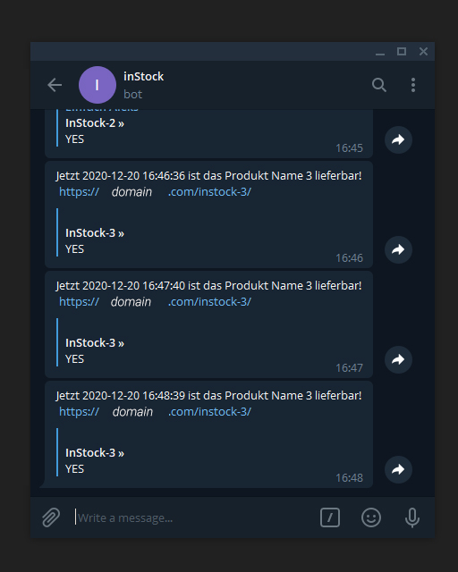

# in-stock-bot

[](LICENSE)

[](stargazers) [](issues)

[](inStockBot) [](inStockBot) [](inStockBot)

A small python Bot with Telegram notifications for checking availability of a product.



## Setup

Change the environment variables in the docker-compose file.

## Usage

Build your Docker Container with

```sh
docker-compose up -d
```

## Bug / Feature Request

If you find a bug (the website couldn't handle the query and / or gave undesired results), kindly open an issue [here](issues) by including your search query and the expected result.

If you'd like to request a new function, feel free to do so by opening an issue here. Please include sample queries and their corresponding results.

# License

| You can check out the full license [here](LICENSE).

This project is licensed under the terms of the MIT license.

[instockbot]: https://github.com/MayNiklas/in-stock-bot
[stargazers]: https://github.com/MayNiklas/in-stock-bot/stargazers
[license]: https://github.com/MayNiklas/in-stock-bot/LICENSE
[issues]: https://github.com/MayNiklas/in-stock-bot/issues
